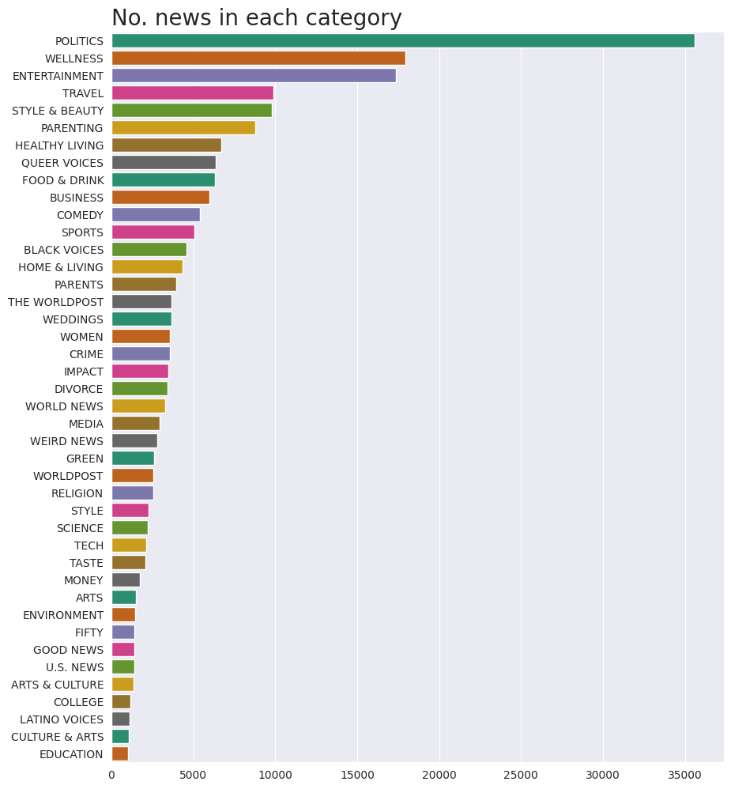
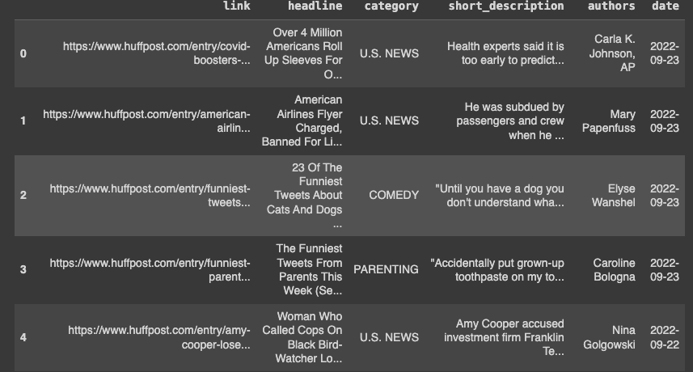
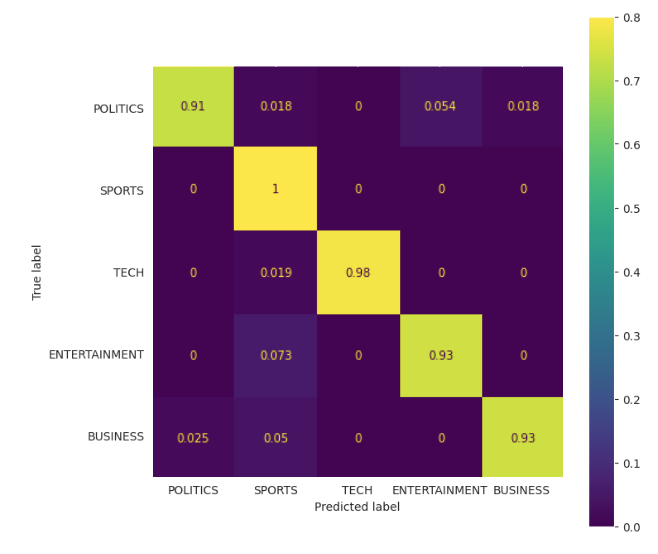

# News Headline Classification with GPT-2

This repository offers a streamlined approach to classifying news headlines into various categories using the GPT-2 model, a powerful transformer-based model known for its excellent language understanding capabilities and a state-of-the-art language processing neural network developed by OpenAI. The goal is to automate the categorization of news content, making it easier to sort, search, and recommend news articles based on their topics. This project focuses on reducing the complexity of classifying a wide array of news into a manageable number of categories while maintaining high accuracy and efficiency.

## Dataset

The dataset, drawn from Kaggle's "News Category Dataset," encompasses a wide array of news stories, each labeled with one of 42 distinct categories. The dataset's structure includes several columns such as link, headline, short_description, authors, and date, which together provide a comprehensive overview of each news story.

Given the broad scope of categories, which can introduce significant complexity to the classification task, we optimized the dataset by selecting the five most represented classes: 'POLITICS', 'SPORTS', 'TECH', 'ENTERTAINMENT', 'BUSINESS'. This reduction allows for a more focused model training process, improving performance by narrowing down the scope to categories with substantial data representation, thus ensuring robust learning and accurate classification.

To access the data and further explore the array of news categories, you can visit the [News Category Dataset](https://www.kaggle.com/datasets/rmisra/news-category-dataset) on Kaggle.

## Getting Started

To get started with this project, clone the repository to your local machine or directly to your preferred development environment: git clone https://github.com/suniash/news_headline_classifier_with_GPT2.git

- Run the Jupyter Notebook to train the model

## Implementation
The classification project is structured in Python using the transformative capabilities of the PyTorch library and Hugging Face's Transformers to fine-tune a GPT-2 model for the categorization of news headlines.

### Model Architecture 

The GPT2SequenceClassifier is built on PyTorch's nn.Module. It harnesses the GPT-2 model's pre-trained layers for rich feature extraction from text data and channels these features into a linear classifier tailored to the number of news categories.

- GPT-2 Core: Utilizes GPT2Model from Hugging Face's transformers, which provides a deep, bidirectional representation of the input text.
- Classifier Head: A linear layer (self.fc1) transforms the GPT-2 output, multiplying the hidden state by the sequence length, to match the number of target classes, serving as the decision-making component of the network.

The forward method directs the data through this two-stage process, outputting the class scores for each input sequence, which are then used to determine the predicted category. This blend of pre-trained knowledge and specialized classification equips the model to tackle the intricacies of news headline categorization.

### Data-Preprocessing

Data preprocessing is a multi-stage process, critical for preparing the headlines for the GPT-2 model:

- Cleaning and Stopwords Removal: Each headline is processed to remove non-alphanumeric characters and extraneous whitespace. Additionally, common English stopwords are filtered out to ensure the model focuses on the most informative words in each headline.

- Balancing the Dataset Across Categories: To address the potential class imbalance, the dataset is balanced by ensuring an equal number of samples from each category, facilitating unbiased model training.

- Category Filtering: While the original dataset comprises 42 categories, we refine our scope to the 5 most common categories - 'POLITICS', 'SPORTS', 'TECH', 'ENTERTAINMENT', 'BUSINESS'. This filtering reduces the problem complexity and allows the model to train more effectively on the most represented classes.

- Tokenization: The GPT-2 tokenizer converts headlines into a machine-readable format, transforming the cleaned text into a sequence of tokens and creating the corresponding attention masks. This tokenization process is crucial for adapting the text data for the model, ensuring each input is uniformly structured for the training phase. The padding length is set to 128.

- Dataset Splitting: The dataset undergoes an initial split into three parts: training (80%), validation (10%), and test (10%). This division is essential to ensure a comprehensive evaluation of the model's performance. 

### Training and Evaluation

The GPT-2 model underwent a concise training period of one epoch, with a learning rate of 1e-5 and a batch size of 8, using the Adam optimizer for adjustments. Training accuracy was recorded at 85.2%, with validation accuracy reaching 97.1%. The model demonstrated a test accuracy of 94%, indicative of its capability to generalize from the training data to unseen examples. These initial results were obtained swiftly, showcasing the efficiency of fine-tuning pre-trained models on specific tasks. The model can be finetuned further to enhance performance. 

## Results

The GPT2SequenceClassifier exhibited promising results after a brief training period, demonstrating the model's adeptness at distinguishing among various news categories. The key indicators of its performance are detailed below:

- Accuracy Metrics: The model achieved a training accuracy of 85.2%, with validation and test accuracies reaching 97.1% and 94%, respectively. These figures underscore the model's capability to generalize well to unseen data.

- Confusion Matrix Analysis: The confusion matrix, a crucial tool for evaluating model performance, revealed insightful patterns about the classifier's behavior across different categories. It highlighted the model's strengths in certain categories while also identifying areas where misclassifications were more common, guiding potential areas for improvement.

- Inference Capability: The model's inference process was tested with unseen news headlines, where it successfully categorized them into the predefined classes. This demonstrates the model's practical applicability in real-world scenarios, where it can assist in organizing and filtering news content based on topics.

The results and the confusion matrix together provide a comprehensive view of the model's capabilities and limitations. The high test accuracy and the insights from the confusion matrix affirm the effectiveness of using a transformer-based model like GPT-2 for text classification tasks. Moreover, the successful inferences on new headlines showcase the model's readiness for deployment in applications requiring automated news categorization.

## Contributing
Contributions to this project are welcome. Please feel free to fork the repository, make your changes, and submit a pull request.

## License
This project is licensed under the MIT License - see the LICENSE file for details.

## Citations
["News Category Dataset."](https://arxiv.org/abs/2209.11429) by Rishabh Misra.

## Acknowledgements
The OpenAI team for the powerful and efficient GPT2 model.The creators of the  datasets used in this project and Kaggle platform for seamless integration of datasets in notebooks. 
